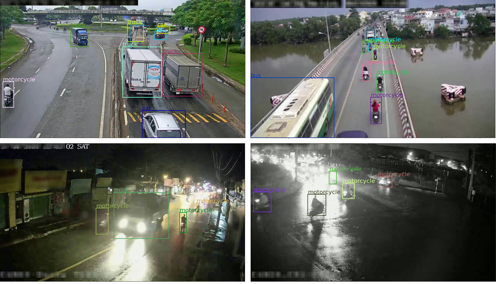

# Vehicle Counting/Tracking using EfficientDet + DeepSORT (Pytorch)

- Source code of ***#Team 059*** for AI City Challenge of Ho Chi Minh City 2020
  - Task info: http://aichallenge.hochiminhcity.gov.vn/huong-dan-nhom-1
  - Leaderboard: http://aichcmc.ml/

# Environments
- pytorch 1.6.0
- Windows 10

# Demo
[Google Colab Tutorial](./demo/AIC_HCMC.ipynb)

# File Structure:
```
this repo
│   detect.py
│   track.py
│   train.py
│
└───configs
│      aic-hcmc.yaml
│      cam_configs.yaml
│
└───datasets  
│   │
│   └───aic-hcmc2020
│       │
│       └───images
│       │     00000.jpg
│       │     00001.jpg
│       │     ....
│       └───annotations
│       │     instances_train.json
│       │     instances_val.json
│       │
│    └───annotations
│    |      cam_01.json
│    └───videos
│        │   
│        │  cam_01.mp4
│        │  cam_02.mp4
│        │  ...
│           
```
# Dataset:
- AIC-HCMC-2020: [link](https://drive.google.com/file/d/1iu4ifOTqnH_t80mL5IGasM6yKxhziPdL/view?usp=sharing)



# Pretrained weights:
- Download pretrained EfficientDet from [original repo](https://github.com/zylo117/Yet-Another-EfficientDet-Pytorch)
- Download finetuned weights on AIC-HCMC-2020 dataset:

Model | Image Size | Weights | MAP-S | MAP-M | MAP-L | ALL
--- | --- | --- | --- | --- | --- | ---
EfficientDet-D2 | 768 x 768 | [link](https://drive.google.com/file/d/1urU0JKQqrI-BNtOCwqLSPr-aue1qWN0U/view?usp=sharing) | 0.068 | 0.312 | 0.390 | 0.32


# Custom dataset:
- To use on custom dataset, see example yaml file in ./configs directory and create a new one and specified:
```
  project_name: <name of project>  # also the folder name of the dataset that under datasets folder
  train_imgs: <training images directory>
  val_imgs: <val images directory>
  train_anns: <training images json annotations>
  val_anns: <val images json annotations>
  obj_list: <list of string contains object name>
  ...
```

# Method:
***Training***
- Split the video into frames using ***preprocess.py***
- To manually label, use [labelme](https://github.com/wkentaro/labelme)
- Download all pretrained weights from above
- Use [EfficientDet](https://arxiv.org/abs/1911.09070) for vehicle detection task, finetune the model on the labeled dataset using ***train.py***
- Use [DeepSORT](https://arxiv.org/abs/1703.07402) for car tracking, not need to retrain this model, only inference

***Inference***
- Use trained detection model to detect vehicle in the video using ***detect.py***, all the bounding boxes, classes prediction will be saved to json files
- Use pretrained tracking model to track vehicle by their results from detection model above, use ***track.py*** 

# Finetuning EfficientDet:
```
python train.py -c=<version number of EfficientDet> --config=<path to project config yaml file>
```
- **Extra Parameters**:
    - ***--resume***:       path to checkpoint to resume training
    - ***--batch_size***:   batch size, recommend 4 - 8
    - ***--head_only***:    if train only the head
    - ***--num_epochs***:   number of epochs
    - ***--saved_path***:   path to save weight
    - ***--val_interval***: validate per number of epochs
    - ***--save_interval***: save per number of iterations
    - ***--log_path***:     tensorboard logging path 

# Inference on AIC-HCMC testset:
***Run detection for detecting bounding boxes and classes confidence scores***
```
python detect.py -c=<version of EfficientDet> --config=<path to project config yaml file> --video_path=<path to video .mp4>
```
- **Extra Parameters**:
    - ***-c***:             version of EfficientDet
    - ***--config***:       configs for detection
    - ***--batch_size***:   batch size, recommend 4 - 8
    - ***--min_conf***:     minimum confident for detection
    - ***--min_iou***:      minimum iou for detection
    - ***--weight***:       pretrained weight
    - ***--saved_path***:   path to save detection results
    - ***--output_path***:    path to save mp4 file
    
***Run tracking on detected bounding boxes and classes confidence scores***
```
python track.py video_name --config=<cam configs> --out_path=<path to save results> 
```
- **Parameters**:
    - ***video_name***:       video name that is defined in config
    - ***--config***:         config for all cam
    - ***--output_path***:    path for output video and counting results
    - ***--display***:        for output video
    
# Results:

| | |
|:-------------------------:|:-------------------------:|
| |  | 
| | |

# References:
- DeepSORT from https://github.com/ZQPei/deep_sort_pytorch
- EfficientDet from https://github.com/zylo117/Yet-Another-EfficientDet-Pytorch
- AIC-HCMC Baseline: https://github.com/hcmcaic/ai-challenge-2020